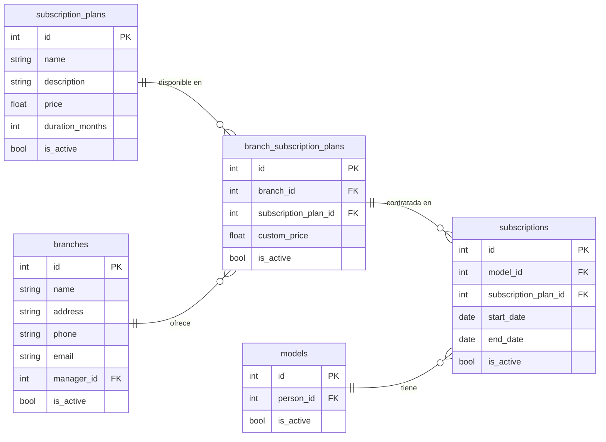

```mermaid
erDiagram
    direction LR
    subscription_plans {
        int id PK
        string name
        string description
        float price
        int duration_months
        bool is_active
    }
    branches {
        int id PK
        string name
        string address
        string phone
        string email
        int manager_id FK
        bool is_active
    }
    models {
        int id PK
        int person_id FK
        bool is_active
    }
    branch_subscription_plans {
        int id PK
        int branch_id FK
        int subscription_plan_id FK
        float custom_price
        bool is_active
    }
    subscriptions {
        int id PK
        int model_id FK
        int subscription_plan_id FK
        date start_date
        date end_date
        bool is_active
    }
    subscription_plans ||--o{ branch_subscription_plans : "disponible en"
    branches ||--o{ branch_subscription_plans : "ofrece"
    branch_subscription_plans ||--o{ subscriptions : "contratada en"
    models ||--o{ subscriptions : "tiene"
```
