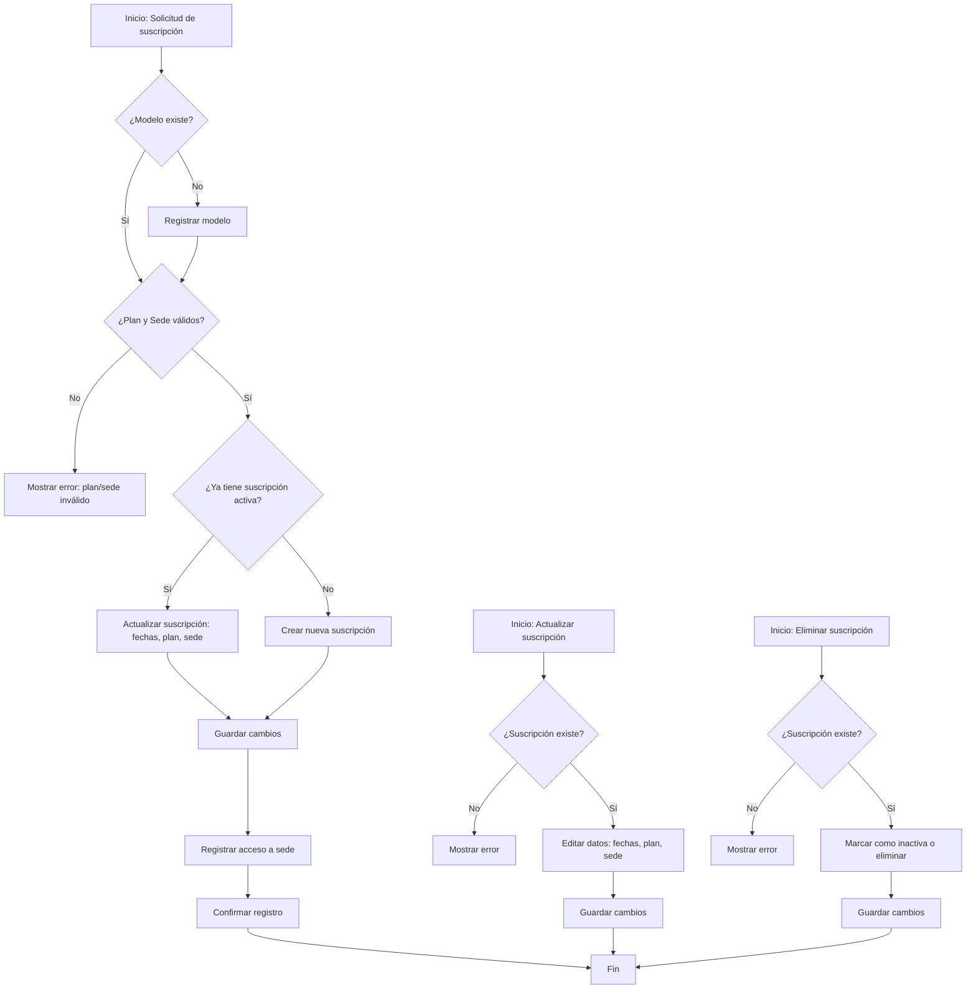

```mermaid
flowchart TD
    A[Inicio: Solicitud de suscripción] --> B{¿Modelo existe?}
    B -- Sí --> C{¿Plan y Sede válidos?}
    B -- No --> Z[Registrar modelo]
    Z --> C
    C -- No --> Y[Mostrar error: plan/sede inválido]
    C -- Sí --> D{¿Ya tiene suscripción activa?}
    D -- Sí --> E[Actualizar suscripción: fechas, plan, sede]
    D -- No --> F[Crear nueva suscripción]
    E --> G[Guardar cambios]
    F --> G
    G --> H[Registrar acceso a sede]
    H --> I[Confirmar registro]
    I --> J[Fin]
    %% Actualización
    J2[Inicio: Actualizar suscripción] --> K{¿Suscripción existe?}
    K -- No --> Y2[Mostrar error]
    K -- Sí --> L[Editar datos: fechas, plan, sede]
    L --> G2[Guardar cambios]
    G2 --> J[Fin]
    %% Borrado
    J3[Inicio: Eliminar suscripción] --> M{¿Suscripción existe?}
    M -- No --> Y3[Mostrar error]
    M -- Sí --> N[Marcar como inactiva o eliminar]
    N --> G3[Guardar cambios]
    G3 --> J[Fin]
```
