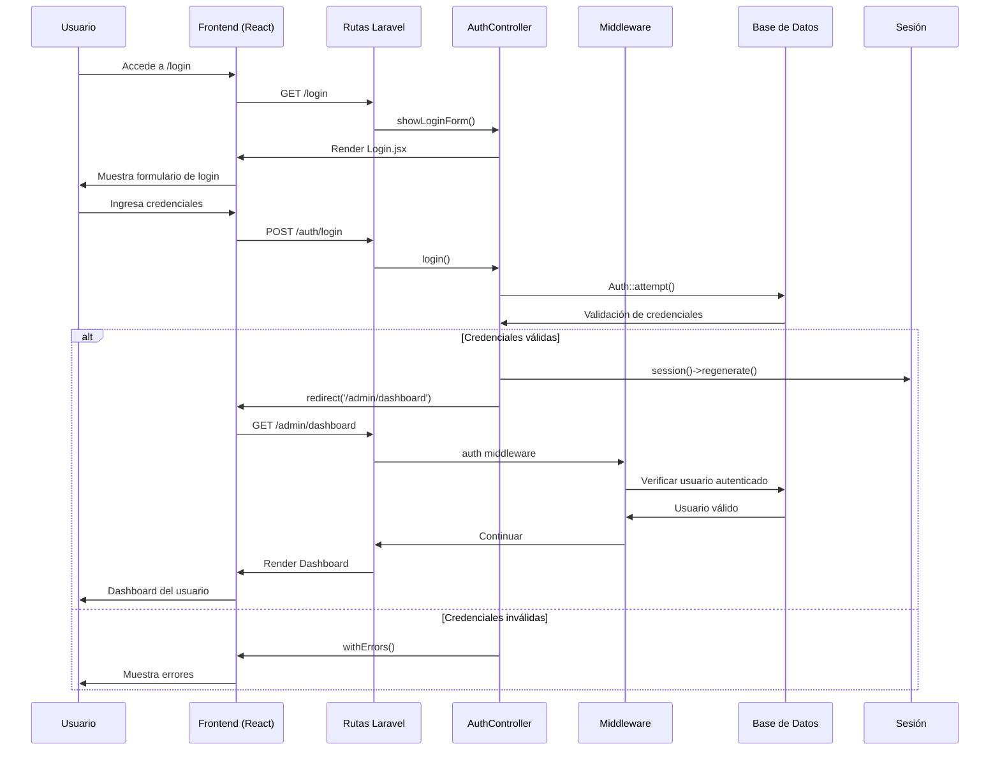
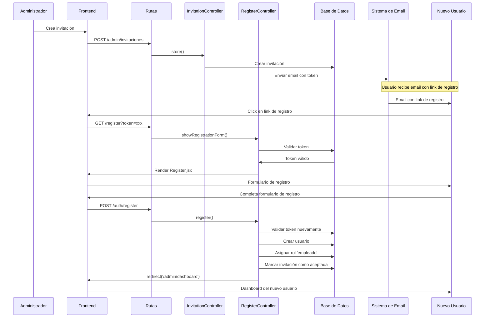
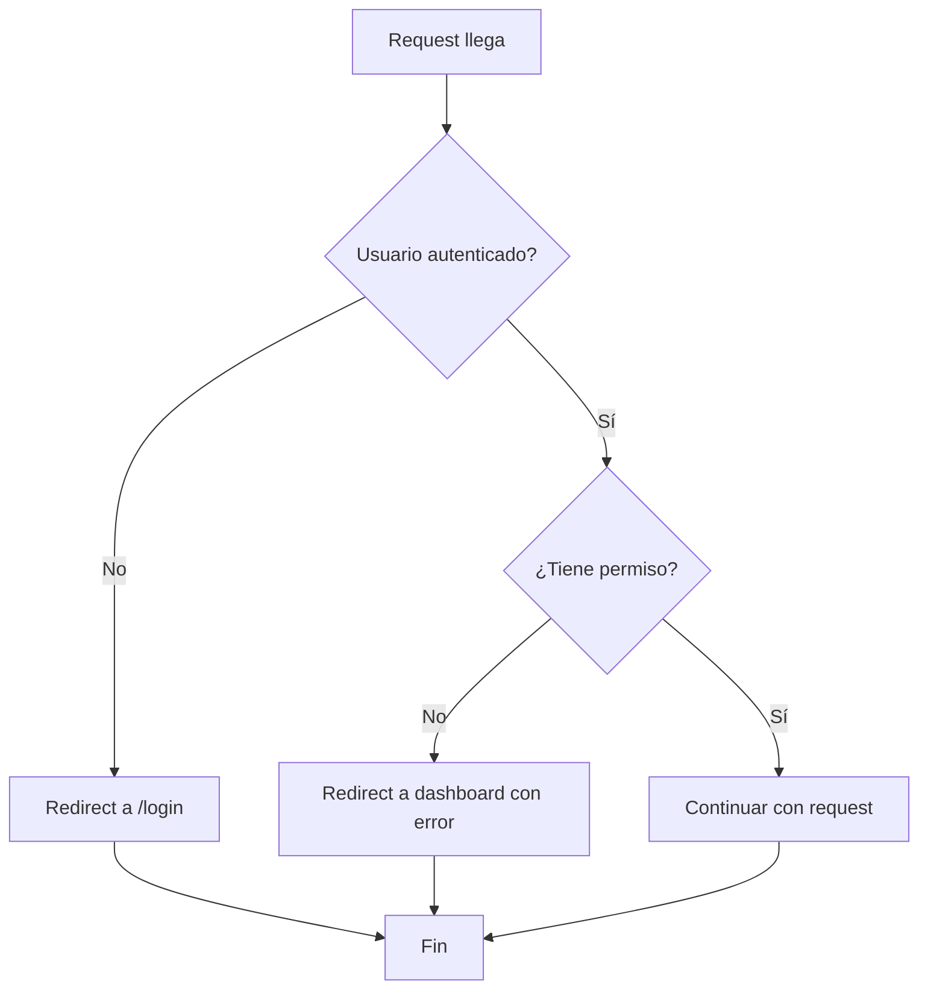

# Sistema de Autenticación, Permisos y Roles

## Flujo Detallado de Autenticación

## Flujo de Registro con Invitación

## Middleware de Verificación de Permisos

## Tecnologías Utilizadas

- **Backend**: Laravel 9 con PHP 8
- **Frontend**: React + Inertia.js
- **Autenticación**: Laravel Sanctum + Session
- **Permisos**: Spatie Laravel Permission
- **Base de Datos**: MySQL/PostgreSQL
- **Middleware**: Custom CheckPermission
- **Hashing**: Bcrypt para contraseñas
- **Tokens**: UUID para invitaciones 