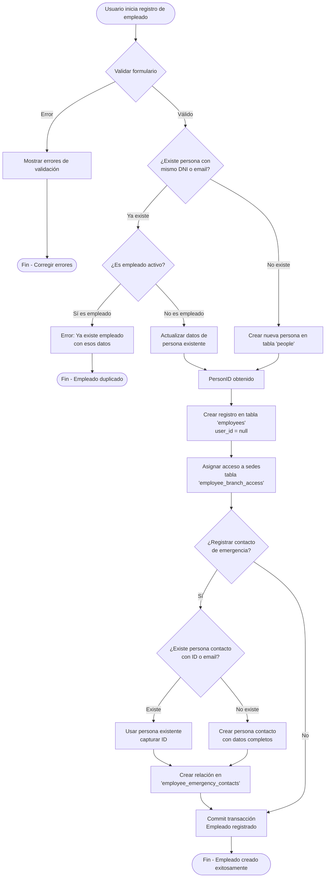

# Flujo de Registro de Empleados - Sistema CMM

## Descripción del Flujo

### 1. **Validación Inicial**
- El sistema valida los datos del formulario del empleado
- Si hay errores, se muestran al usuario

### 2. **Verificación de Persona Existente**
- Se busca si ya existe una persona con el mismo DNI o email
- **Si no existe**: Se crea una nueva persona
- **Si existe**: Se verifica si ya es empleado activo

### 3. **Validación de Empleado Duplicado**
- Si la persona ya es empleado activo, se rechaza el registro
- Si no es empleado, se actualizan sus datos

### 4. **Registro del Empleado**
- Se crea el registro en la tabla `employees` con `user_id = null`
- Los usuarios del sistema se crean posteriormente mediante invitaciones
- Se asignan las sedes de acceso en `employee_branch_access`

### 5. **Contacto de Emergencia (Opcional con Checkbox)**
- Mediante un checkbox, se puede decidir si registrar un contacto de emergencia
- Si se activa el checkbox:
  - Se verifica si la persona ya existe por **identificación** o **email**
  - Si no existe, se crea con datos completos (nombres, apellidos, identificación, tipo de ID, teléfono, email)
  - Si existe, se captura su ID
  - Se establece la relación en `employee_emergency_contacts`
- Si se desactiva el checkbox, se omite completamente el registro del contacto

### 6. **Finalización**
- Se confirma la transacción
- El empleado queda registrado exitosamente

### Notas Importantes:
- **No se crean usuarios del sistema**: Los usuarios se gestionan mediante el sistema de invitaciones
- **Contacto de emergencia opcional**: Se puede activar/desactivar mediante checkbox
- **Validación mejorada de contactos**: Se verifica por identificación y email para evitar duplicados
- **Campos completos del contacto**: Incluye nombres, apellidos, identificación, tipo de ID, teléfono y email
- **Reutilización de personas**: Si una persona ya existe, se actualiza o reutiliza su información