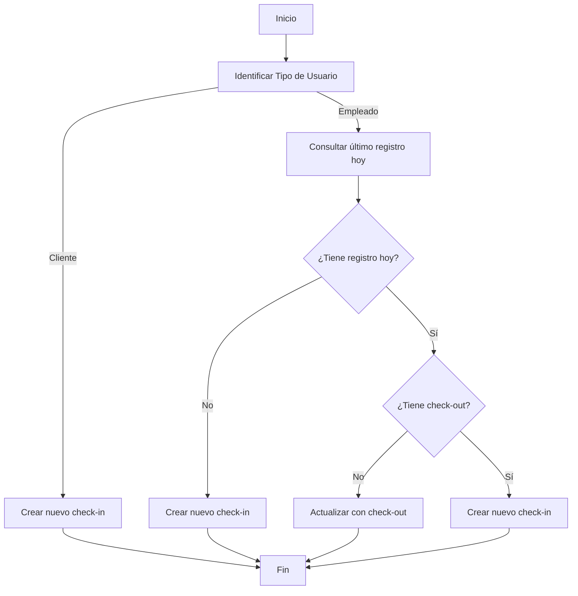

```mermaid
graph TD
    A[Inicio] --> B[Identificar Tipo de Usuario]
    B -->|Empleado| C[Consultar último registro hoy]
    B -->|Cliente| D[Crear nuevo check-in]
    C --> E{¿Tiene registro hoy?}
    E -->|No| F[Crear nuevo check-in]
    E -->|Sí| G{¿Tiene check-out?}
    G -->|No| H[Actualizar con check-out]
    G -->|Sí| I[Crear nuevo check-in]
    D --> J[Fin]
    F --> J
    H --> J
    I --> J
```
